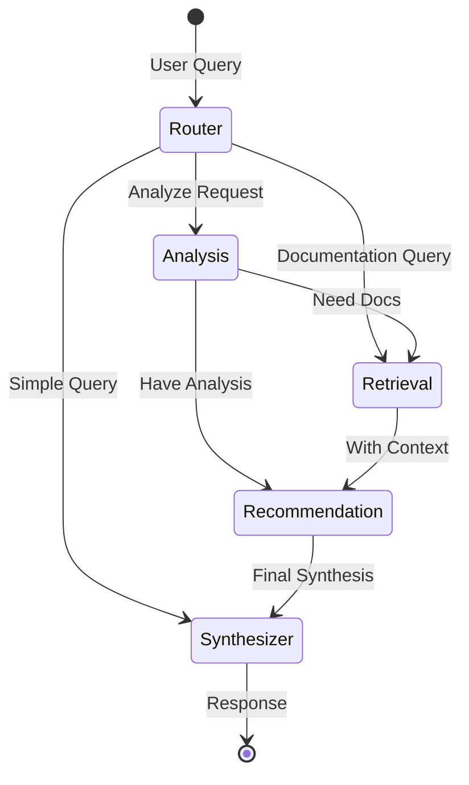
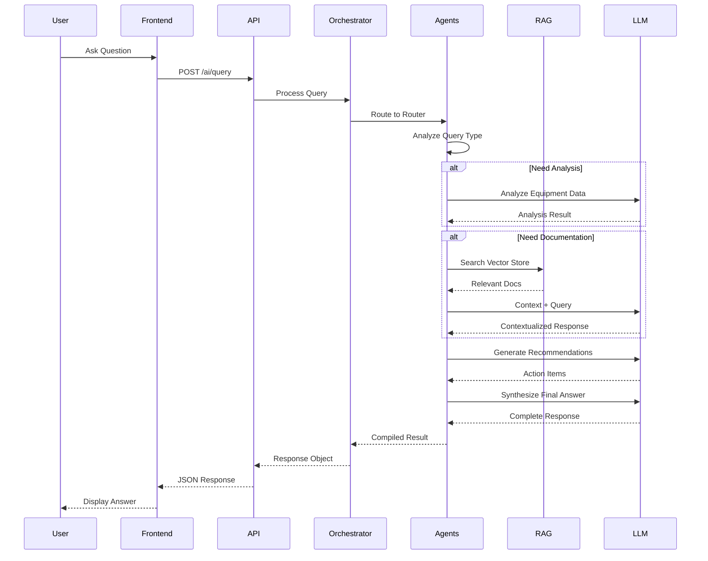

# System Architecture

## High-Level Architecture

```mermaid
graph TB
    subgraph "Frontend Layer"
        UI[React UI]
        Executive[Executive Dashboard]
        Operator[Operator Dashboard]
    end
    
    subgraph "API Layer"
        API[FastAPI Backend]
        Equipment[Equipment API]
        Dashboard[Dashboard API]
        AI[AI API]
    end
    
    subgraph "Service Layer"
        DataService[Data Service]
        RAG[RAG Pipeline]
        Orchestrator[Multi-Agent Orchestrator]
    end
    
    subgraph "Agent Layer"
        Router[Router Agent]
        Analysis[Analysis Agent]
        Retrieval[Retrieval Agent]
        Recommendation[Recommendation Agent]
        Synthesizer[Synthesizer Agent]
    end
    
    subgraph "Data Layer"
        Equipment DB[(Equipment Data)]
        Vector[(ChromaDB)]
        OpenAI[OpenAI GPT-4]
    end
    
    UI --> Executive
    UI --> Operator
    Executive --> API
    Operator --> API
    
    API --> Equipment
    API --> Dashboard
    API --> AI
    
    Equipment --> DataService
    Dashboard --> DataService
    AI --> Orchestrator
    
    Orchestrator --> Router
    Router --> Analysis
    Router --> Retrieval
    Analysis --> Recommendation
    Retrieval --> Recommendation
    Recommendation --> Synthesizer
    
    DataService --> Equipment DB
    Retrieval --> RAG
    RAG --> Vector
    Analysis --> OpenAI
    Retrieval --> OpenAI
    Recommendation --> OpenAI
    Synthesizer --> OpenAI
```

## Multi-Agent Workflow



## Data Flow - AI Query Processing



## Component Architecture

### Backend Components

```
backend/
├── app/
│   ├── agents/           # Multi-agent orchestration
│   │   └── orchestrator.py
│   ├── api/              # REST API endpoints
│   │   ├── equipment.py
│   │   ├── dashboard.py
│   │   └── ai.py
│   ├── core/             # Configuration
│   │   └── config.py
│   ├── models/           # Data models
│   │   └── schemas.py
│   ├── rag/              # RAG pipeline
│   │   └── pipeline.py
│   ├── services/         # Business logic
│   │   └── data_service.py
│   └── main.py           # FastAPI app
├── scripts/              # Utility scripts
│   └── seed_data.py
└── tests/                # Test suite
```

### Frontend Components

```
frontend/
├── src/
│   ├── components/       # Reusable components
│   ├── views/            # Page components
│   │   ├── ExecutiveDashboard.tsx
│   │   └── OperatorDashboard.tsx
│   ├── services/         # API integration
│   │   └── api.ts
│   └── App.tsx           # Main application
```

## Technology Stack

### Backend
- **Framework**: FastAPI (Python 3.11+)
- **AI Orchestration**: LangGraph
- **Vector Store**: ChromaDB
- **LLM**: OpenAI GPT-4
- **Data Validation**: Pydantic

### Frontend
- **Framework**: React 18 + TypeScript
- **Build Tool**: Vite
- **Styling**: Tailwind CSS
- **Charts**: Recharts
- **Icons**: Lucide React

### Infrastructure
- **Containerization**: Docker
- **Orchestration**: Docker Compose
- **CI/CD**: GitHub Actions

## Key Design Patterns

### 1. Multi-Agent Pattern
Each agent has a specific responsibility:
- **Router**: Determines query type and routing
- **Analysis**: Analyzes equipment data and metrics
- **Retrieval**: Searches documentation using RAG
- **Recommendation**: Generates actionable advice
- **Synthesizer**: Compiles final response

### 2. RAG Pipeline
Retrieval-Augmented Generation for documentation:
1. Documents chunked and embedded
2. Stored in vector database
3. Semantic search on queries
4. Context provided to LLM

### 3. Service Layer Pattern
Business logic separated from API layer:
- Data Service handles equipment data
- RAG Pipeline manages documentation
- Orchestrator coordinates agents

### 4. Dual View Pattern
Two interfaces for different users:
- Executive: Strategic overview, KPIs
- Operator: Tactical details, AI assistant
